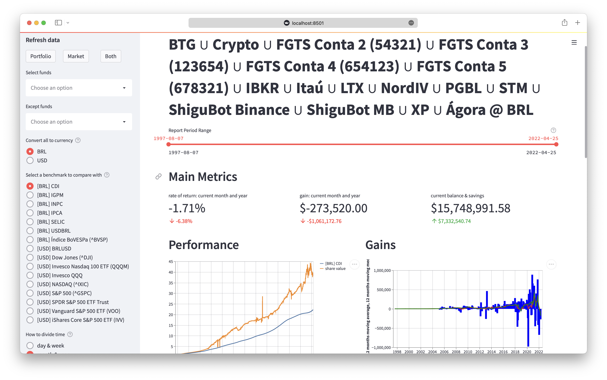
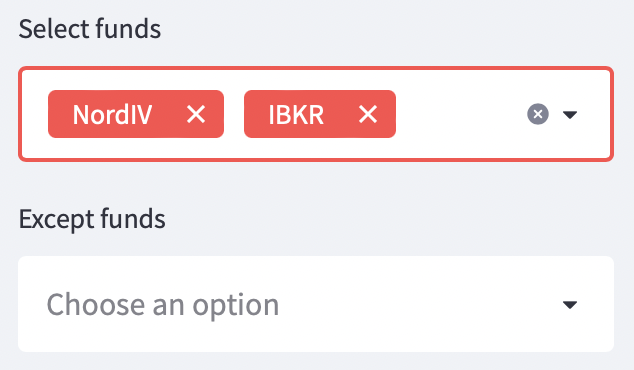
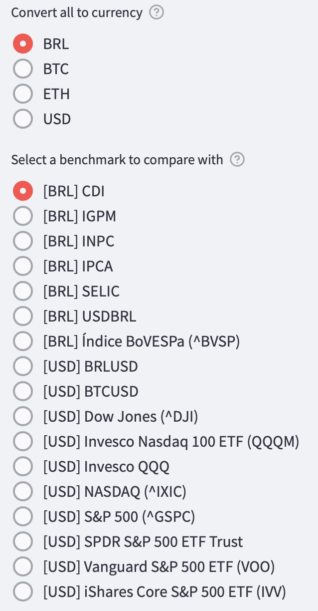
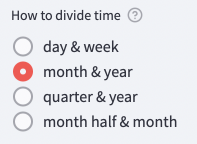
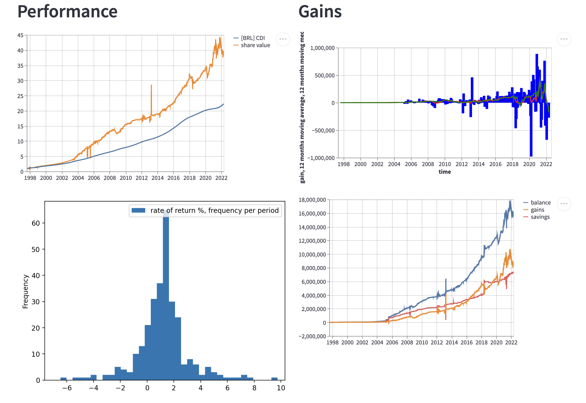
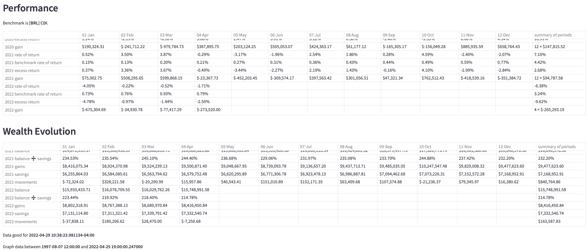

# Personal Investments Dashboard

Personal web application to manage a diverse investment portfolio in multiple currencies, including crypto and market indexes. Delivered as a [Streamlit](https://streamlit.io/) app. Includes also a module to hack your investments in Jupyter notebooks.



Dashboards reads your **ledger** and **balances** from an online Google Spreadsheet ([see example](https://docs.google.com/spreadsheets/d/1AE0F_mzXTJJuuuQwPnSzBejRrmui01CfUUY1qyvnbkk)), gets historical benchmarks and currency convertion tables from multiple configurabe internet sources, and created a rich explorable dashboard.

All or some or each of your investments are internally normalized into a single “fund” with **number of shares** and **share value**. From there, multiple visualizations are possible.

## Install and Run

Runs on macOS, Windows, Linux or anywhere Python, Pandas and Streamlit can be installed.
Here is a video I put in place that shows Investorzilla getting installed on a Mac
and run for the first time with its [example portfolio file](https://github.com/avibrazil/investorzilla/blob/main/config_examples/investorzilla.yaml).

[](http://www.youtube.com/watch?v=CrR-PoXhPQY "Install and use Investorzilla")

### Install

After getting Python 3 installed, install [Investorzilla](https://pypi.org/project/investorzilla/) with `pip`:

```
pip install investorzilla --user
```

### Configure

Create a folder and then build your `investorzilla.yaml` file with information about data sources, benchmarks and currencies.

Start with the examples from https://github.com/avibrazil/investorzilla/blob/main/config_examples/

### Run

After installing your API keys (in case of using CryptoCompare data), run it like the following from the same folder containing `investorzilla.yaml`:

```
investorzilla
```

Access the dashboard on http://localhost:8501 (or remotelly if your browser is in a different machine)

## Features

### Virtual Funds

Create a unified virtual fund with only some of the investments found in your portfolio spreadsheet.



Your whole porfolio will be used if left balnk. Then you might *exclude* some to match the particular visualization you are trying to attain.

### Currency and Benchmarks

You may track your investments using multiple currencies, inluding crypto. I have investments in USD and BRL. You can create virtual funds that mix different currencies, in this case you must select a currency under which you’ll view that (virtual) fund. Values from your spreadsheet will be converted to the target currency on a daily basis.

Also, you might compare your investment performance with market benchmarks as S&P 500, NASDAQ index etc. Just remember to use a benchmark that matches the current currency, otherwise comparisons won’t make sense.



### Period Selector



If you have enough or high frequency data, you can divide time in more granular regular periods. Default is monthy view with an anual summary.

## Graphs and Reports



Currently supports 4 graphs, from left to right, top to bottom:

1. Virtual share value performance compared to a selected benchmark
2. Periodic (monthly, weekly) gain, along with 12M moving average and moving median
3. Frequency histogram of percent return rate per period (default is per month)
4. Fund savings, balance and gains (which is pure balance minus savings)

There is also numerical reports showing:

1. Performance
   1. Periodic (monthly) rate of return with an macro-period (yearly) accumulated value
   2. Same for selecte benchmark
   3. Excess return over benchmark
   4. Periodic and accumulated gain
2. Wealth Evolution
   1. Current balance
   2. Balance over savings
   3. Cumulated gains
   4. Cumulated savings
   5. Movements on the periods, which is the sum of money added to and removed from virtual fund



## Usage Tips

1. Select a custom period on the slider
2. View your main metrics on top of report
3. To optimize screen usage, on the the top right menu, select **Settings** and then **Wide mode**
4. Hide the left panel to gain even more screen real estate
5. Use **Refresh data** buttons to update local cache with latest info from your **porfolio spreadsheet**, **market data** or **both**.